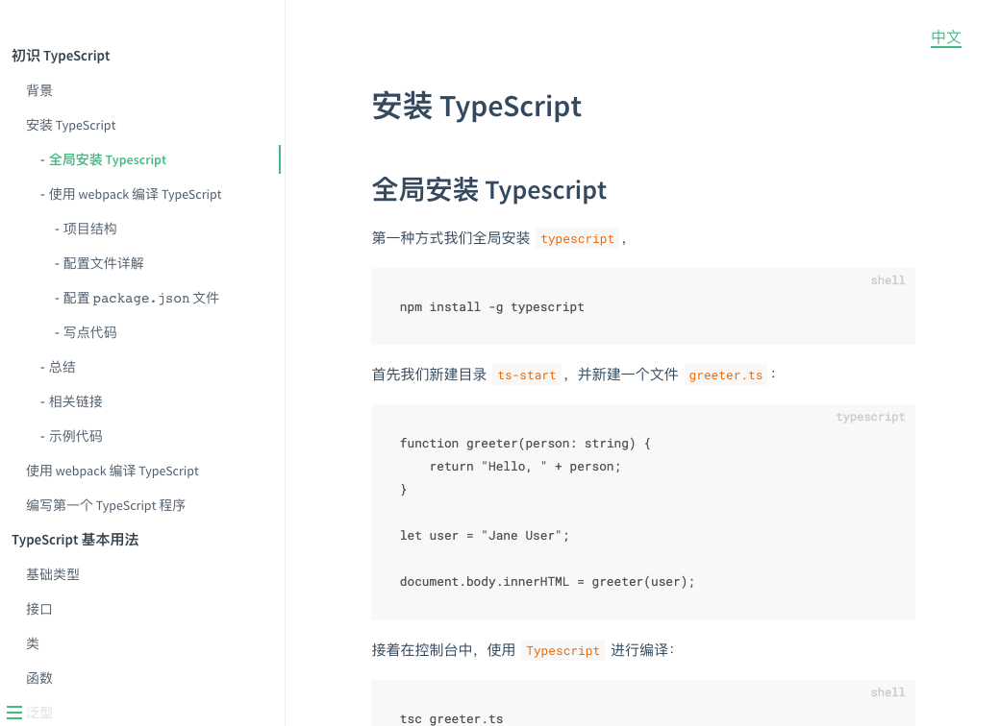

## 安装运行
```shell
# clone 项目
git clone git@github.com:darrell0904/typescript-doc.git

# 全局安装 http-server
npm install -g http-server

# 进入到 doc 文档目录
# 起一个服务
http-server ./
```

&nbsp;

## 写文档的原因

自己平时在开发中也会使用 `TypeScript`，但是说时候只会使用一些简单的，比如说指定变量的类型，一些深层次的高级类型自己都没怎么涉及过，这就是我写这个文档的原因，让自己更加全面的掌握 `TypeScript`。

&nbsp;

## `github` 图片出不来？

- 首先打开 `host` 文件

```nginx
sudo vi /etc/hosts
```

- 接着添加以下内容

```nginx
# GitHub Start

192.30.253.112    github.com
192.30.253.119    gist.github.com
199.232.28.133    assets-cdn.github.com
199.232.28.133    raw.githubusercontent.com
199.232.28.133    gist.githubusercontent.com
199.232.28.133    cloud.githubusercontent.com
199.232.28.133    camo.githubusercontent.com
199.232.28.133    avatars0.githubusercontent.com
199.232.28.133    avatars1.githubusercontent.com
199.232.28.133    avatars2.githubusercontent.com
199.232.28.133    avatars3.githubusercontent.com
199.232.28.133    avatars4.githubusercontent.com
199.232.28.133    avatars5.githubusercontent.com
199.232.28.133    avatars6.githubusercontent.com
199.232.28.133    avatars7.githubusercontent.com
199.232.28.133    avatars8.githubusercontent.com

# GitHub End
```

- 保存，退出，重新刷新 `github` 页面


> 具体原因大家可以参考这篇文章：[解决github图片不显示的问题](https://blog.csdn.net/qq_38232598/article/details/91346392)

&nbsp;

## 项目截图

整个文档是用 [dosify ](https://docsify.js.org/#/zh-cn/) 搞得，截图如下：




&nbsp;

## 项目文章目录

正在编写中。。。


&nbsp;

## 参考资料

这里列举了笔者学习 `typescript` 的主要来源，其余的参考资料我会再每一节发出来

* [极客时间 TypeScript 实战](https://time.geekbang.org/course/intro/211) 