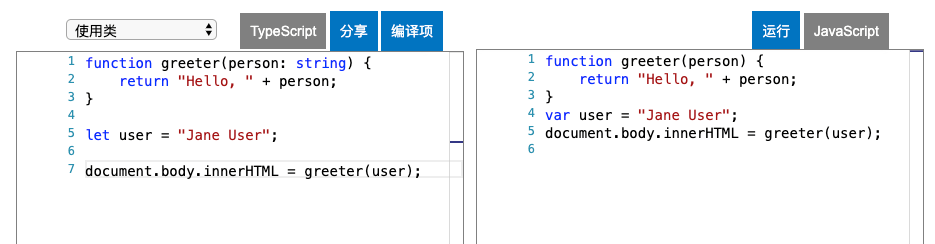
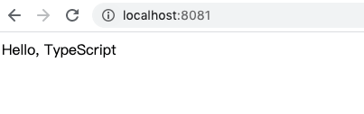

# 安装 TypeScript

## 全局安装 Typescript

第一种方式我们全局安装 `typescript`，

```shell
npm install -g typescript
```

首先我们新建目录 `ts-start`，并新建一个文件 `greeter.ts`：

```typescript
function greeter(person: string) {
    return "Hello, " + person;
}

let user = "Jane User";

document.body.innerHTML = greeter(user);
```

接着在控制台中，使用 `Typescript` 进行编译：

```shell
tsc greeter.ts
```

我们可以发现在统计目录下生成了 `greeter.js` 文件，它将 `ts` 内容编译成了 `js` 的内容，具体内容如下：

```javascript
function greeter(person) {
    return "Hello, " + person;
}
var user = "Jane User";
document.body.innerHTML = greeter(user);
```

同时我们可以去 [官网编译](https://www.tslang.cn/play/index.html) 我们的代码，结果也完全一致，如下图：



这是最直接也是最简单的编译 `ts` 的方式，接下来我们讲一下使用 `webpack` 构建工具来帮我们编译 `ts` 代码。

## 使用 webpack 编译 TypeScript

一般在项目中，我们不会直接使用 `tsc` 来编译 `TypeScript` 代码，我们会借助一些构建工具来帮我们完成编译，比如 `webpack`、`rollup`、`gulp` 等工具。

接下来，我们会使用 `webpack` 来打包我们 `ts` 代码项目，因为 `webpack` 是当下社区最火的构建工具，配置灵活和插件化扩展**，**官方更新迭代速度快，它已经成为了我们不得不学的一项技术。当然在本文档中我们不会深入的讲解 `webpack`，如果大家对 `webpack` 有兴趣的话，可以参考笔者整理的 [webpack 学习文档](https://github.com/darrell0904/webpack-doc)，在这个文档中笔者从基础配置、实战配置、原理分析等都有详细解释。

话不多说，我们来使用 `webpack` 来编译 `typescript`。

### 项目结构

```javascript
.
├── config    	// webpack 配置的文件目录
    ├── webpack.config.js       // 配置入口文件
    ├── webpack.base.config.js  // 公用配置文件
    ├── webpack.dev.config.js  // 开发环境配置文件
    └── webpack.prod.config.js  // 生产环境配置文件
├── node_modules  // 依赖文件夹
├── src  // 业务代码文件
	├── index.html  // 模版文件
	└── index.ts  	// 入口文件
├── .gitignore    // git 忽略文件
├── tsconfig.json  // typescript 配置文件
└── package.json // 当前整一个项目的依赖
```

### 配置文件详解

#### 入口配置文件

`webpack.config.js` 为入口配置文件，它的作用是根据传入的环境来使用 **开发环境** 还是 **生产环境** 的配置，接着和 **公共配置** 文件通过 `webpack-merge` 进行合并，具体代码如下：

```javascript
const merge = require('webpack-merge')
const baseConfig = require('./webpack.base.config') // 公共配置
const devConfig = require('./webpack.dev.config') // 开发配置
const proConfig = require('./webpack.pro.config') // 生产环境配置

module.exports = (env, argv) => {
    let config = argv.mode === 'development' ? devConfig : proConfig;
    return merge(baseConfig, config);
};
```

#### 公共配置文件

公共配置文件，顾名思义是在 **开发环境** 和 **生产环境** 中都会用到的配置，具体代码如下：

```javascript
const HtmlWebpackPlugin = require('html-webpack-plugin') // 

module.exports = {
	entry: {
        'app': './src/index.ts' // 入口文件
	},
	output: {
		filename: '[name].[chunkhash:8].js' // 输出文件
	},
	resolve: {
		extensions: ['.js', '.ts', '.tsx'], // 指定相应的扩展名
	},
	module: {
		rules: [
			{
				test: /\.tsx?$/,
				use: [{
					loader: 'ts-loader', // 使用 ts-loader 编译 ts 文件
				}],
				exclude: /node_modules/
			},
		]
	},
	plugins: [
		new HtmlWebpackPlugin({
			template: './src/index.html'
		}),
	]
}
```

其中我们使用 `ts-loader` 来编译我们的 `ts` 文件，同时使用 `html-webpack-plugin` 将打包好的文件注入到相应的模版文件 `index.html` 中。

#### 开发环境配置

只作用于开发时的配置文件：

```javascript
module.exports = {
    devtool: 'cheap-module-eval-source-map'
}
```

#### 生产环境配置

只作用于额生产环境的配置文件：

```javascript
const { CleanWebpackPlugin } = require('clean-webpack-plugin')

module.exports = {
    plugins: [
        new CleanWebpackPlugin()
    ]
}

```

我们使用插件 `clean-webpack-plugin` 来自动帮我们清除上一次构建出来的 `dist` 目录。


### 配置 `package.json` 文件

接着我们来配置 `package.json` 文件，我们写两个命令，一个是用于本地开发，一个用生产构建。

```json
"scripts": {
    "start": "webpack-dev-server --mode=development --config ./config/webpack.config.js",
    "build": "webpack --mode=production --config ./config/webpack.config.js"
},
```

详细的 `package.json` 文件如下，包含了我们配置文件中所需要安装的一些依赖等：

```json
{
  "name": "ts-start",
  "version": "1.0.0",
  "description": "",
  "main": "index.js",
  "scripts": {
    "start": "webpack-dev-server --mode=development --config ./config/webpack.config.js",
    "build": "webpack --mode=production --config ./config/webpack.config.js"
  },
  "author": "",
  "license": "ISC",
  "devDependencies": {
    "clean-webpack-plugin": "^3.0.0",
    "html-webpack-plugin": "^4.3.0",
    "ts-loader": "^7.0.3",
    "typescript": "^3.8.3",
    "webpack": "^4.43.0",
    "webpack-cli": "^3.3.11",
    "webpack-dev-server": "^3.10.3",
    "webpack-merge": "^4.2.2"
  }
}

```

&nbsp;

### 写点代码

现在万事具备，我们可以在 `index.ts` 中写点代码，在页面中打印出 `Hello, TypeScript`：

```typescript
// src/index.ts

const hello: string = 'Hello, TypeScript';
document.querySelectorAll('.app')[0].innerHTML = hello;
```

同时我们还要完善一下模版文件 `index.html`：

```html
<!DOCTYPE html>
<html lang="en">
<head>
    <meta charset="UTF-8">
    <meta name="viewport" content="width=device-width, initial-scale=1.0">
    <meta http-equiv="X-UA-Compatible" content="ie=edge">
    <title>Learn TypeScript</title>
</head>
<body>
    <div class="app"></div>
</body>
</html>

```

接着我们在命令行中输入 `npm start`，我们可以在浏览器中看到打印出了 `Hello,Typescript`：



## 总结

到这里，关于 `TypeScript` 代码的两种编译方式我们都讲完了，接下来的文章中，我们会主要使用 `webpack` 这个来讲解 `ts` 的一些语法，大家可以先试着配置一下，示例代码我会放在文章底部。


## 相关链接

* [webpack 学习笔记](https://github.com/darrell0904/webpack-doc)
* [TypeScript 中文文档](https://www.tslang.cn/index.html)


## 示例代码 

示例代码可以看这里：

* [TypeScript webpack 构建  示例代码]